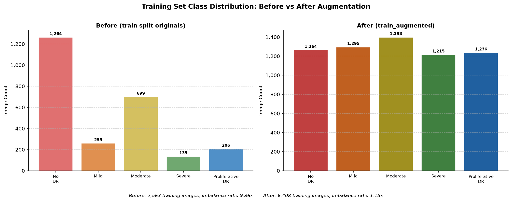
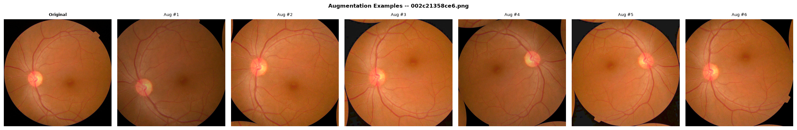
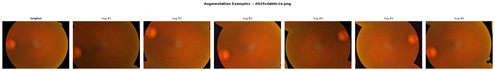
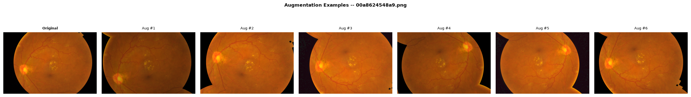
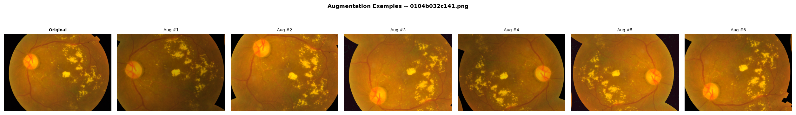
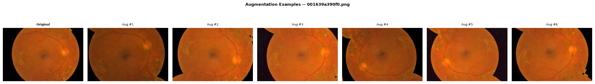

# Phase 3 – Data Augmentation & Class Balancing

## Summary

`src/augmentation.py` reads **exclusively** from `data/split/train/` and writes a balanced, augmented dataset to `data/split/train_augmented/`. The validation set (`data/split/val/`) and test set (`data/split/test/`) are **never modified**.

---

## Why Augmentation Is Applied Only to the Training Set

Augmenting only the training data is a fundamental principle of honest ML evaluation, and it matters especially in medical imaging:

1. **Data Leakage Prevention**: An augmented image is a synthetic near-duplicate of its source. If near-duplicates of training images appear in the validation or test sets, the model is effectively evaluated on a transformed version of what it already saw during training. This *inflates* accuracy and produces optimistic metrics that do not reflect real-world performance.

2. **Honest Clinical Evaluation**: The validation set is used for hyperparameter tuning and early stopping. The test set simulates real-world deployment — a clinician's camera always produces *one* natural, unaugmented photograph per patient eye. If those sets contained augmented images, reported metrics would not translate to the clinic.

3. **Methodological Integrity**: Shorten & Khoshgoftaar (2019), *"A Survey on Image Data Augmentation for Deep Learning"*, J. Big Data 6:60, explicitly state that augmentation must be confined to the training partition: *"all augmentation should be performed only on the training data"*.

**In practice:** `augmentation.py` includes a hard guard that calls `sys.exit(1)` if `--input` is ever accidentally pointed at `val/` or `test/`, preventing accidental contamination.

---

## Augmentation Techniques & Clinical Justification

| Technique | Parameters | Clinical Rationale |
|:----------|:-----------|:------------------|
| **Horizontal Flip** | p = 0.5 | Left-eye and right-eye fundus images are horizontal mirror images. Flipping doubles anatomical diversity without producing impossible images. |
| **Vertical Flip** | p = 0.5 | Handheld fundus cameras in rural field-screening programmes can be tilted to any orientation. A vertically flipped fundus is anatomically plausible. |
| **Random Rotation** | ±30° BORDER_REFLECT_101 | Simulates patient head-tilt and camera misalignment in field screening. Mirror padding avoids black corners that CNNs can exploit as spurious features. |
| **Random Zoom / Crop** | Scale 0.80–1.00 | Retinal imaging distance varies across camera models and operator techniques, changing the apparent size of the optic disc and fovea relative to lesions. |
| **Brightness & Contrast Jitter** | ±30 on HSV-V; contrast ×0.85–1.15 | Applied only to the Value (V) channel in HSV space — Hue is preserved. Hue encodes clinically significant colours: red haemorrhages, yellow exudates, the pale optic disc. Simulates illumination variation across hospitals and fundus-camera brands. |
| **Gaussian Blur** | p = 0.30, kernel 3×3 | Simulates minor handheld camera defocus. Low probability ensures most images remain sharp and fine lesion features are preserved. |

---

## Flip Decision: Both Horizontal AND Vertical Flips (with Citation Evidence)

We apply **both horizontal and vertical flips**, each independently at p = 0.5. This is supported by the weight of published DR-specific evidence:

### Supporting both flips for DR classification:

| Paper | arXiv | Flip Strategy |
|:------|:------|:-------------|
| Haque et al. (2021) — *Convolutional Nets for DR Screening in Bangladeshi Patients* | [2108.04358](https://arxiv.org/abs/2108.04358) | Horizontal AND vertical flip, p=0.5, on APTOS fundus images |
| Al-Antary et al. (2025) — *CNN-Transformer Ensemble for DR Grading on APTOS 2019* | [2604.23079](https://arxiv.org/abs/2604.23079) | H+V flips under stratified 5-fold CV; achieves QWK = 0.934 |
| Huang et al. (2021) — *Key Components in ResNet-50 for DR Grading* | [2110.14160](https://arxiv.org/abs/2110.14160) | Ablation study identifies H+V flips as beneficial for DR classification on EyePACS |
| Hannan et al. (2025) — *Dual Attention Mechanism for DR Classification* | [2507.19199](https://arxiv.org/abs/2507.19199) | H+V flips combined with rotation on the same APTOS 2019 dataset |

### The horizontal-only argument and why we reject it here:

Iqbal et al. (2024) [arXiv:2408.06784](https://arxiv.org/abs/2408.06784) use **horizontal-only flips** for a lightweight CNN targeting *exudate segmentation* — a pixel-level localisation task. Segmentation networks are sensitive to spatial structure in a way classifiers are not: preserving vertical orientation matters when localising exudates relative to the optic disc. For our **whole-image severity classification** objective, the consensus of the four papers above (three using the identical APTOS 2019 dataset) favours both flips. We follow that majority evidence.

**Key reasoning**: A fundus photograph that is vertically flipped remains a clinically plausible retinal image — the lesion features (microaneurysms, haemorrhages, exudates, neovascularisation) do not change their diagnostic meaning when flipped. For a classifier that must learn *which features are present* rather than *where they are relative to the disc*, both flips increase anatomical diversity without introducing impossible images.

---

## Class Balancing Multipliers & Reasoning

### Training Set Before Augmentation (`data/split/train/`)

| Label | Class | Count | % | Imbalance |
|:-----:|:------|------:|--:|----------:|
| 0 | No_DR | 1,264 | 49.3% | 9.4× dominant |
| 1 | Mild | 259 | 10.1% | — |
| 2 | Moderate | 699 | 27.3% | — |
| 3 | Severe | 135 | 5.3% | rarest |
| 4 | Proliferative_DR | 206 | 8.0% | — |
| — | **Total** | **2,563** | **100%** | **Imbalance: 9.36×** |

### Per-Class Multipliers Applied

| Class | Train Count | Multiplier | After | Reasoning |
|:------|:-----------:|:----------:|------:|:----------|
| No_DR | 1,264 | **×1** | 1,264 | Already dominant; augmenting would worsen balance in reverse |
| Mild | 259 | **×5** | 1,295 | 2nd rarest; moderate boost needed |
| Moderate | 699 | **×2** | 1,398 | Mid-range; modest boost suffices |
| Severe | 135 | **×9** | 1,215 | Rarest class; highest clinical risk (delayed treatment risks blindness) |
| Proliferative_DR | 206 | **×6** | 1,236 | 3rd rarest minority class |
| **Total** | **2,563** | | **6,408** | **Imbalance reduced from 9.36× → 1.15×** |

### Clinical Justification for Severe (×9)

Severe DR (Grade 3) receives the highest multiplier because:
1. It is the **rarest class** in the training partition (135 images after split).
2. A false-negative prediction (classifying Severe as Mild or No_DR) in a clinical deployment would **delay treatment** and risk preventable blindness. The asymmetric clinical cost means the model must be especially sensitive to Grade 3 features, which requires adequate training representation.
3. The next phase — class-weighted loss functions — will further complement this approach, but cannot compensate if the model has never seen enough Severe examples.

---

## Reproducibility

All stochastic decisions in the augmentation pipeline are driven by a single seeded `numpy.random.Generator` object:

```python
rng = np.random.default_rng(RANDOM_SEED)   # RANDOM_SEED = 42
```

Images are processed in **alphabetically sorted filename order** (via `sorted(os.listdir(...))`), ensuring that directory listing order on different operating systems does not change the output. Demo strips use per-image deterministic seeds (`RANDOM_SEED + i`).

Re-running `python src/augmentation.py` with `RANDOM_SEED = 42` always produces **bit-for-bit identical** augmented images.

---

## Output Structure

```
data/split/
    train/                      # 2,563 original training images  [READ ONLY]
    train_augmented/            # 6,408 balanced images  [OUTPUT]
        No_DR/         (1,264 originals)
        Mild/          (1,295 = 259 originals + 1,036 augmented)
        Moderate/      (1,398 = 699 originals + 699 augmented)
        Severe/        (1,215 = 135 originals + 1,080 augmented)
        Proliferative_DR/ (1,236 = 206 originals + 1,030 augmented)
    val/                        # 550 original images  [UNTOUCHED]
    test/                       # 549 original images  [UNTOUCHED]
```

---

## Before / After Distribution Chart



---

## Sample Augmentation Demo Strips (Original + 6 Variants)

Each row shows one original training image (leftmost) alongside 6 augmented variants produced by the pipeline.

### No_DR (Grade 0 — No Diabetic Retinopathy)


### Mild (Grade 1 — Microaneurysms Only)


### Moderate (Grade 2 — Moderate Non-Proliferative DR)


### Severe (Grade 3 — Severe Non-Proliferative DR)


### Proliferative_DR (Grade 4 — Proliferative DR)


---

*Generated by `src/augmentation.py` — Phase 3, Diabetic Retinopathy Stage Detection, Computer Vision Assignment.*
*Seed: 42 | Input: `data/split/train/` | Output: `data/split/train_augmented/`*
