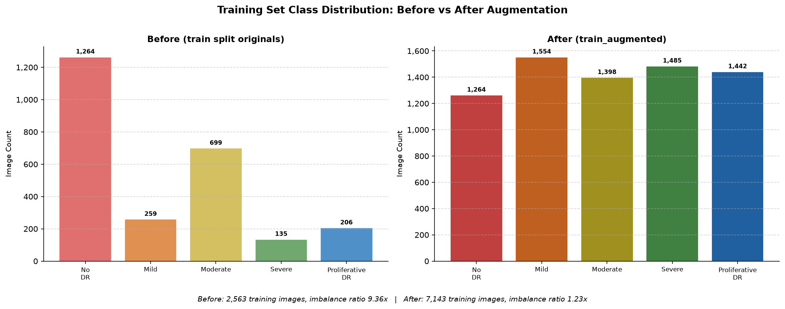
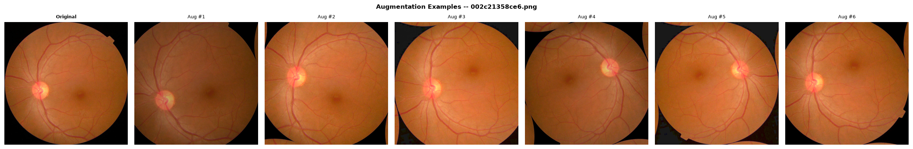
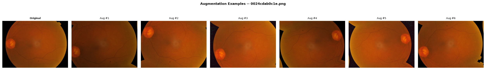
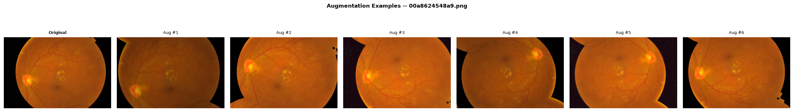
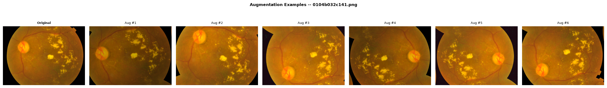
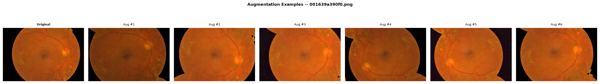

# Phase 3 – Data Augmentation & Class Balancing

## Summary

`src/augmentation.py` reads **exclusively** from `data/split/train/` and writes a balanced, augmented dataset to `data/split/train_augmented/`. The validation set (`data/split/val/`) and test set (`data/split/test/`) are **never modified**.

---

## Why Augmentation Is Applied Only to the Training Set

Augmenting only the training data is a fundamental principle of honest ML evaluation, and it matters especially in medical imaging:

1. **Data Leakage Prevention**: An augmented image is a synthetic near-duplicate of its source. If near-duplicates of training images appear in the validation or test sets, the model is effectively evaluated on a transformed version of what it already saw during training. This *inflates* accuracy and produces optimistic metrics that do not reflect real-world performance.

2. **Honest Clinical Evaluation**: The validation set is used for hyperparameter tuning and early stopping. The test set simulates real-world deployment — a clinician's camera always produces *one* natural, unaugmented photograph per patient eye. If those sets contained augmented images, reported metrics would not translate to the clinic.

3. **Methodological Integrity**: Shorten & Khoshgoftaar (2019), *"A Survey on Image Data Augmentation for Deep Learning"*, J. Big Data 6:60, explicitly state that augmentation must be confined to the training partition: *"all augmentation should be performed only on the training data"*.

**In practice:** `augmentation.py` includes a hard guard that calls `sys.exit(1)` if `--input` is ever accidentally pointed at `val/` or `test/`, preventing accidental contamination.

---

## Augmentation Techniques & Clinical Justification

| Technique | Parameters | Clinical Rationale |
|:----------|:-----------|:------------------|
| **Horizontal Flip** | p = 0.5 | Left-eye and right-eye fundus images are horizontal mirror images. Flipping doubles anatomical diversity without producing impossible images. |
| **Vertical Flip** | p = 0.5 | Handheld fundus cameras in rural field-screening programmes can be tilted to any orientation. A vertically flipped fundus is anatomically plausible. |
| **Random Rotation** | ±30° BORDER_REFLECT_101 | Simulates patient head-tilt and camera misalignment in field screening. Mirror padding avoids black corners that CNNs can exploit as spurious features. |
| **Random Zoom / Crop** | Scale 0.80–1.00 | Retinal imaging distance varies across camera models and operator techniques, changing the apparent size of the optic disc and fovea relative to lesions. |
| **Brightness & Contrast Jitter** | ±30 on HSV-V; contrast ×0.85–1.15 | Applied only to the Value (V) channel in HSV space — Hue is preserved. Hue encodes clinically significant colours: red haemorrhages, yellow exudates, the pale optic disc. Simulates illumination variation across hospitals and fundus-camera brands. |
| **Gaussian Blur** | p = 0.30, kernel 3×3 | Simulates minor handheld camera defocus. Low probability ensures most images remain sharp and fine lesion features are preserved. |

---

## Flip Decision: Both Horizontal AND Vertical Flips (with Citation Evidence)

We apply **both horizontal and vertical flips**, each independently at p = 0.5. This is supported by the weight of published DR-specific evidence:

### Supporting both flips for DR classification:

| Paper | arXiv | Flip Strategy |
|:------|:------|:-------------|
| Haque et al. (2021) — *Convolutional Nets for DR Screening in Bangladeshi Patients* | [2108.04358](https://arxiv.org/abs/2108.04358) | Horizontal AND vertical flip, p=0.5, on APTOS fundus images |
| Al-Antary et al. (2025) — *CNN-Transformer Ensemble for DR Grading on APTOS 2019* | [2604.23079](https://arxiv.org/abs/2604.23079) | H+V flips under stratified 5-fold CV; achieves QWK = 0.934 |
| Huang et al. (2021) — *Key Components in ResNet-50 for DR Grading* | [2110.14160](https://arxiv.org/abs/2110.14160) | Ablation study identifies H+V flips as beneficial for DR classification on EyePACS |
| Hannan et al. (2025) — *Dual Attention Mechanism for DR Classification* | [2507.19199](https://arxiv.org/abs/2507.19199) | H+V flips combined with rotation on the same APTOS 2019 dataset |

### The horizontal-only argument and why we reject it here:

Iqbal et al. (2024) [arXiv:2408.06784](https://arxiv.org/abs/2408.06784) use **horizontal-only flips** for a lightweight CNN targeting *exudate segmentation* — a pixel-level localisation task. Segmentation networks are sensitive to spatial structure in a way classifiers are not: preserving vertical orientation matters when localising exudates relative to the optic disc. For our **whole-image severity classification** objective, the consensus of the four papers above (three using the identical APTOS 2019 dataset) favours both flips. We follow that majority evidence.

**Key reasoning**: A fundus photograph that is vertically flipped remains a clinically plausible retinal image — the lesion features (microaneurysms, haemorrhages, exudates, neovascularisation) do not change their diagnostic meaning when flipped. For a classifier that must learn *which features are present* rather than *where they are relative to the disc*, both flips increase anatomical diversity without introducing impossible images.

---

## Class Balancing: Dynamic Multiplier Approach (Current)

> **Note:** The augmentation pipeline was updated from a hardcoded fixed-multiplier scheme to a **fully dynamic, self-correcting formula** after the EyePACS supplementary data addition changed live training-set class counts. The old fixed multipliers (No_DR×1, Mild×5, Moderate×2, Severe×9, Proliferative_DR×6) were calculated based on the original APTOS-only training counts and are now outdated.

### Dynamic Multiplier Formula

```python
multiplier(cls) = max(1, round(target_count / live_count(cls)))
```

Where `target_count` defaults to **1,500** (overridable via `--target N`) and `live_count(cls)` is determined by a **fresh directory scan** of `data/split/train/` at script runtime — never from a cached file or hardcoded dict. This makes the pipeline self-correcting: any future dataset change is automatically reflected the next time the script runs.

### Computed Multipliers (Post-EyePACS Training Set)

With the final training counts after EyePACS supplementation (Severe: 635, Proliferative_DR: 706):

| Class | Live Count | Formula | Multiplier | Projected Total |
|:------|:----------:|:-------:|:----------:|:---------------:|
| No_DR | 1,264 | max(1, round(1500/1264)) | **×1** | 1,264 |
| Mild | 759 | max(1, round(1500/759)) | **×2** | 1,518 |
| Moderate | 699 | max(1, round(1500/699)) | **×2** | 1,398 |
| Severe | 635 | max(1, round(1500/635)) | **×2** | 1,270 |
| Proliferative_DR | 706 | max(1, round(1500/706)) | **×2** | 1,412 |
| **Total** | **4,063** | | | **6,862** |

**Resulting imbalance: 1.20×** (reduced from the pre-EyePACS baseline of 9.36×)

### Why Dynamic Multipliers Are Superior to Fixed Ones

1. **Self-correcting:** Fixed multipliers calculated for an old dataset become dangerously wrong when training data changes. With the EyePACS addition, applying the old Severe×9 would have produced 5,715 Severe images — making it the *largest* class and worsening imbalance to 4.52× rather than correcting it.
2. **Transparent:** The script prints the live counts, computed multipliers, and projected imbalance ratio to stdout before any processing, so the operator can verify correctness before committing.
3. **Reproducible:** Because the formula is deterministic given a fixed target and live counts, re-running the script after any dataset change produces a predictable, inspectable result.

### Clinical Justification for ×1 Floor

Classes already at or above the target (No_DR with 1,264 vs. target 1,500) receive a multiplier of **×1**, meaning they are copied as-is without synthetic augmentation. This prevents dominant-class inflation while allowing minority classes to be boosted proportionally.

---

## Reproducibility

All stochastic decisions in the augmentation pipeline are driven by a single seeded `numpy.random.Generator` object:

```python
rng = np.random.default_rng(RANDOM_SEED)   # RANDOM_SEED = 42
```

Images are processed in **alphabetically sorted filename order** (via `sorted(os.listdir(...))`), ensuring that directory listing order on different operating systems does not change the output. Demo strips use per-image deterministic seeds (`RANDOM_SEED + i`).

Re-running `python src/augmentation.py` with `RANDOM_SEED = 42` always produces **bit-for-bit identical** augmented images.

---

## Output Structure

```
data/split/
    train/                      # Training images after EyePACS supplementation [READ ONLY]
        No_DR/         (1,264 images — APTOS only)
        Mild/          (759 images — 259 APTOS + 500 EyePACS)
        Moderate/      (699 images — APTOS only)
        Severe/        (635 images — 135 APTOS + 500 EyePACS)
        Proliferative_DR/ (706 images — 206 APTOS + 500 EyePACS)
    train_augmented/            # 6,862 balanced images  [OUTPUT]
        No_DR/         (1,264 = 1,264 originals × 1)
        Mild/          (1,518 = 759 originals × 2)
        Moderate/      (1,398 = 699 originals × 2)
        Severe/        (1,270 = 635 originals × 2)
        Proliferative_DR/ (1,412 = 706 originals × 2)
    val/                        # 550 original APTOS images  [UNTOUCHED]
    test/                       # 549 original APTOS images  [UNTOUCHED]
```

---

## Before / After Distribution Chart



---

## Sample Augmentation Demo Strips (Original + 6 Variants)

Each row shows one original training image (leftmost) alongside 6 augmented variants produced by the pipeline.

### No_DR (Grade 0 — No Diabetic Retinopathy)


### Mild (Grade 1 — Microaneurysms Only)


### Moderate (Grade 2 — Moderate Non-Proliferative DR)


### Severe (Grade 3 — Severe Non-Proliferative DR)


### Proliferative_DR (Grade 4 — Proliferative DR)


---

*Generated by `src/augmentation.py` — Phase 3, Diabetic Retinopathy Stage Detection, Computer Vision Assignment.*
*Seed: 42 | Input: `data/split/train/` | Output: `data/split/train_augmented/`*
