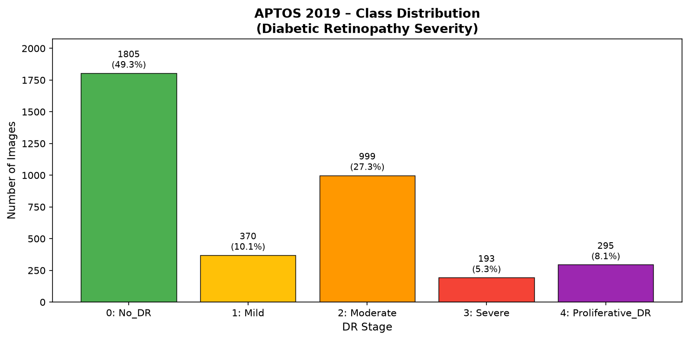
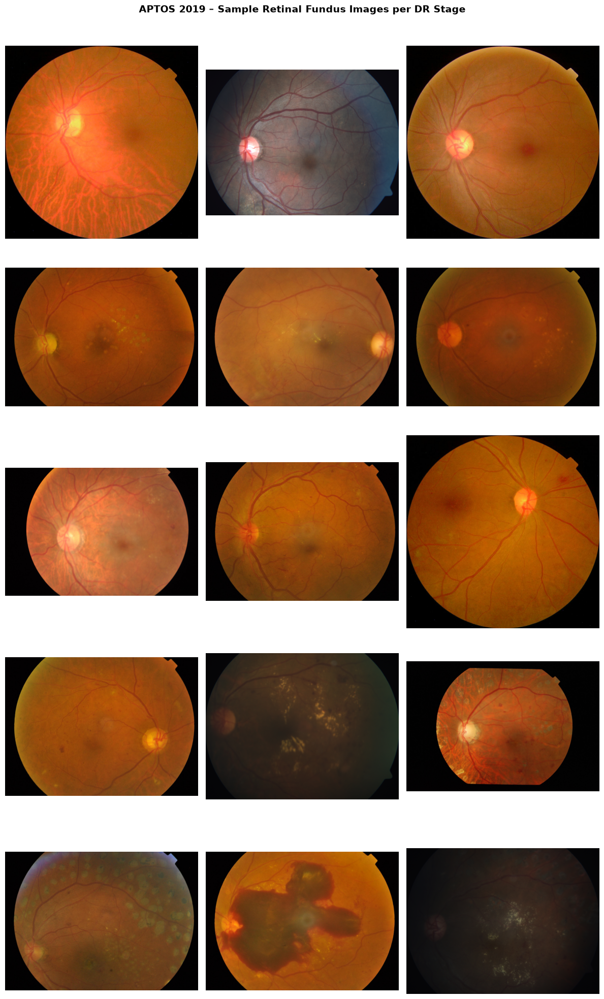

# Dataset Overview – APTOS 2019 Diabetic Retinopathy Dataset

## What the Dataset Contains

The **APTOS 2019 Blindness Detection** dataset, sourced from Kaggle, consists of **3,662 high-resolution retinal fundus photographs** taken with a fundus camera under varying imaging conditions (different hospitals across rural India).  Each image has been graded by trained clinicians on the **International Clinical Diabetic Retinopathy (ICDR) severity scale** and assigned an integer label 0–4:

| Label | Class Name         | Clinical Meaning                                                                 |
|-------|--------------------|----------------------------------------------------------------------------------|
| 0     | No_DR              | No signs of diabetic retinopathy                                                |
| 1     | Mild               | Microaneurysms only                                                              |
| 2     | Moderate           | More than just microaneurysms but less than severe NPDR                         |
| 3     | Severe             | Many more haemorrhages; microaneurysms in all 4 quadrants; no neovascularisation|
| 4     | Proliferative_DR   | Neovascularisation or vitreous/pre-retinal haemorrhage (most advanced stage)    |

Images are stored as `.png` files named by an anonymised `id_code`.  A companion `train.csv` maps each `id_code` to its `diagnosis` label.

---

## How the Organising Script Works (`src/organize_dataset.py`)

The organising step is a critical and demonstrable pipeline step required by the assignment brief:

1. **Load** `data/raw/train_images/train.csv` using `pandas`.
2. **Create** one subdirectory per class inside `data/organized/`  
   (`No_DR/`, `Mild/`, `Moderate/`, `Severe/`, `Proliferative_DR/`).
3. **Copy** each `.png` from `data/raw/train_images/` into the matching class folder using `shutil.copy2`.  The raw data is **never modified**; the organised tree is a second, clean copy.
4. **Report** per-class counts and percentages to stdout.
5. **Save** 3 sample images per class here for report reference.
6. **Save** a bar-chart (`class_distribution.png`) and a visual montage (`sample_montage.png`) of sample images for the report.

The script is fully parameterised via CLI arguments so it is reproducible on any machine or in a Colab/Kaggle notebook environment.

---

## Class Imbalance Analysis

Running `src/organize_dataset.py` yields the following distribution:

| Label | Class Name         | Count | Percentage |
|-------|--------------------|-------|------------|
| 0     | No_DR              | 1805  | 49.3 %     |
| 1     | Mild               |  370  | 10.1 %     |
| 2     | Moderate           |  999  | 27.3 %     |
| 3     | Severe             |  193  |  5.3 %     |
| 4     | Proliferative_DR   |  295  |  8.1 %     |
| **—** | **Total**          | **3662** | **100 %** |

**Key observations:**

- The dataset is **severely imbalanced**.  The dominant class (No_DR, 49.3 %) has almost **9.4×** more images than the rarest class (Severe, 5.3 %).
- This mirrors real-world clinical prevalence, where most screened patients have no or moderate retinopathy.
- **Implications for modelling:**  A naive model that always predicts class 0 would achieve ~49 % accuracy but zero clinical utility.  We must address this imbalance through:
  - **Data augmentation** (Phase 3) – increasing minority-class diversity.
  - **Class-weighted loss functions** – penalising misclassification of rare, serious stages more heavily.
  - **Oversampling** (optional) – duplicating or synthesising minority class samples.

---

## Sample Images Per Class

The sample montage (`sample_montage.png`) shows 3 representative fundus photographs from each DR stage.  Key visual differences:

- **No_DR**: Clear optic disc, uniform orange-red background, no lesions.
- **Mild**: Tiny microaneurysms (small red dots) visible near the macula.
- **Moderate**: More microaneurysms; small haemorrhages; some hard exudates (bright yellow patches).
- **Severe**: Widespread haemorrhages in all retinal quadrants; venous beading.
- **Proliferative_DR**: Abnormal new blood vessel growth (neovascularisation); pre-retinal haemorrhages obscuring the field.

---

## Ethical Considerations in Medical Imaging Datasets

1. **Patient Anonymisation**: All images in APTOS 2019 are de-identified — no patient name, date, or demographic data is stored.  The `id_code` is a pseudonymous hash.

2. **Informed Consent**: Data was collected as part of a screening programme in India.  Participants consented to screening; re-use for AI research falls under the Kaggle Data Agreement, but production deployment would require explicit ethics board approval.

3. **Dataset Bias**: Images were taken at multiple clinics with different equipment and lighting conditions.  A model trained solely on this data may not generalise to retinal cameras used in other healthcare systems (equipment bias, population bias).

4. **Label Quality**: Grading was performed by human clinicians — inter-grader variability means some labels may be inconsistent near stage boundaries (especially Mild vs. Moderate).

5. **Deployment Risk**: Misclassifying a **Severe** or **Proliferative** case as **No_DR** could delay treatment and cause preventable blindness.  Any clinical deployment must include a human-in-the-loop review step and should *not* rely solely on automated predictions.

6. **Class Imbalance as an Ethical Issue**: An imbalanced model might perform well on average but fail disproportionately on minority classes — the very stages that are most clinically urgent.  Robust evaluation must be reported *per class* (precision, recall, F1 per stage), not just overall accuracy.

---

*Generated by `src/organize_dataset.py` — Phase 1, Diabetic Retinopathy Stage Detection, Computer Vision Assignment.*
