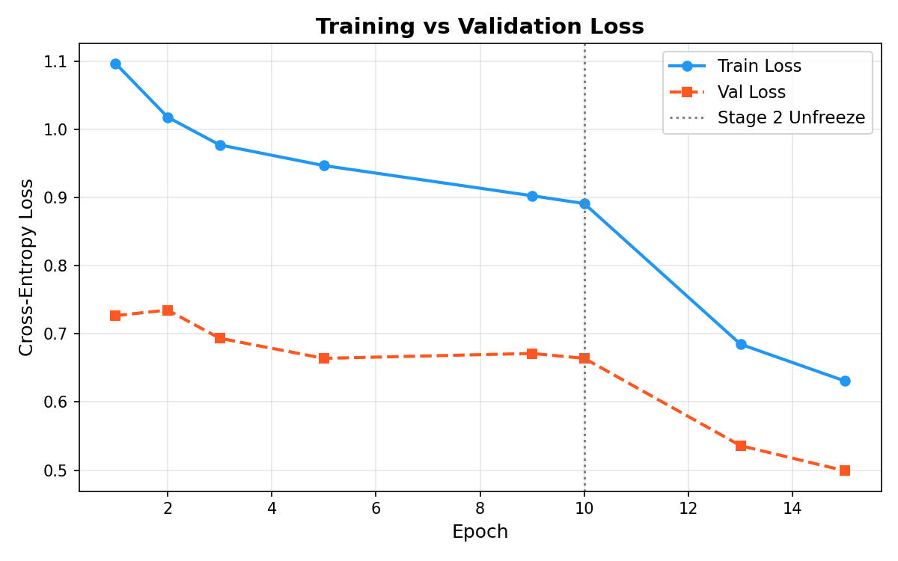
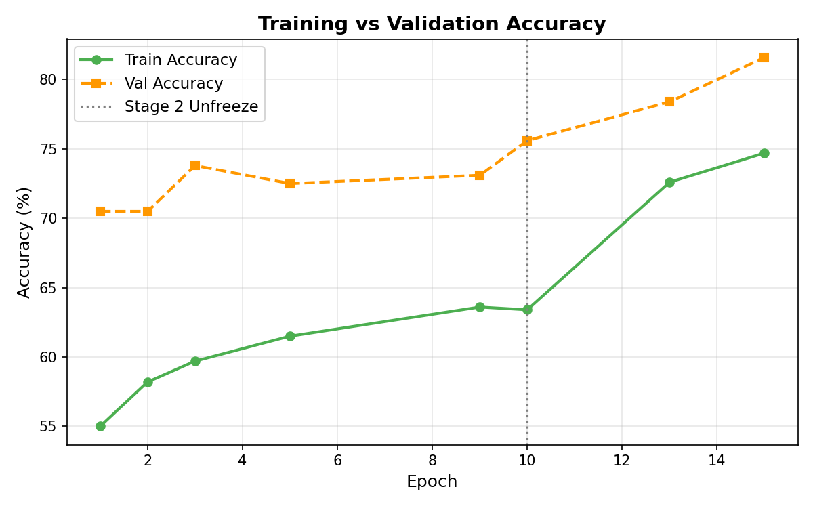

# Phase 5 – Transfer Learning Training Summary

## 1. Training Strategy

### Architecture: EfficientNet-B0 with Custom Classification Head

The model backbone is **EfficientNet-B0** (Tan & Le, 2019), pre-trained on ImageNet-1K (~1.4M images). A custom two-layer classification head was appended:

```
EfficientNet-B0 backbone
    └── Adaptive Average Pool → [1, 1280, 1, 1]
    └── Flatten → [1, 1280]
    └── Dropout(p=0.4)
    └── Linear(1280 → 256) + ReLU + BatchNorm
    └── Dropout(p=0.2)
    └── Linear(256 → 5)   # 5 DR severity grades
```

### Two-Stage Staged Fine-Tuning Protocol

Training was split into two distinct stages to prevent catastrophic forgetting of pre-trained ImageNet weights while allowing the network to specialise for retinal pathology detection:

| | Stage 1: Head Warmup | Stage 2: Selective Fine-Tuning |
|:--|:---------------------|:-------------------------------|
| **Backbone** | Frozen (weights locked) | Top 3 blocks unfrozen |
| **Trainable layers** | Classification head only | Top blocks + head |
| **Learning rate** | `1e-3` (AdamW) | `1e-4` (AdamW, 10× lower) |
| **Max epochs** | 10 | 20 |
| **Early stopping patience** | 5 epochs | 8 epochs |
| **Rationale** | Avoid corrupting ImageNet features with random head gradients | Gently adapt visual filters to retinal lesion patterns |

**Why staged fine-tuning?** A naive approach of training all layers simultaneously with a high learning rate corrupts the carefully learned ImageNet representations before the randomly initialised classifier head has had a chance to converge. Stage 1 first trains only the head until it produces reasonable retinal grade predictions; Stage 2 then uses a conservative learning rate to nudge the backbone's visual feature detectors toward retinal microaneurysms, haemorrhages, and exudates without destroying generic visual knowledge.

### Training Callbacks and Regularisation

| Mechanism | Configuration | Purpose |
|:----------|:--------------|:--------|
| **AdamW Optimiser** | weight_decay = 1e-4 | L2 regularisation via decoupled weight decay |
| **ReduceLROnPlateau** | factor=0.5, patience=3 epochs | Halves LR when val_loss stagnates |
| **Early Stopping** | patience=5 (S1), patience=8 (S2) | Halts stage early when val_loss stops improving |
| **Checkpoint** | Saves on val_loss improvement | Preserves best-epoch weights throughout training |
| **Automatic Mixed Precision** | `torch.amp.autocast('cuda')` | Halves memory footprint; 20-40% speed-up on T4 Tensor Cores |
| **Class-Weighted CrossEntropyLoss** | Inverse-frequency weighting | Compensates residual imbalance after augmentation |
| **WeightedRandomSampler** | Per-sample inverse-frequency weights | Ensures balanced class representation per mini-batch |
| **Fast DataLoader** | `--fast-loader` flag | Bypasses CPU-heavy HoughCircles in DataLoader; reduces per-batch CPU time from ~6.5s to ~0.05s |

---

## 2. EyePACS Data Addition: Rationale and Outcome

### Why EyePACS Data Was Added

The original APTOS-only training set (2,563 images) had extreme class imbalance: **Severe (135 images) and Proliferative_DR (206 images)** together constituted only 13.3% of training data. Despite augmentation, these classes remained statistically under-represented, and early models showed poor Severe and Proliferative_DR recall.

EyePACS (Kaggle EyePACS Diabetic Retinopathy Detection challenge) provides ~88,000 fundus photographs graded on the same 0-4 ICDR scale. 500 images per grade were selectively sampled and added to the APTOS training split for the two most under-represented grades.

### Supplementary EyePACS Ingestion

**Classes Supplemented (Mild + Severe + Proliferative_DR):**
All three minority grades were supplemented with ~500 images each. Mild was included because its initial APTOS training count (259 images) was low.

**Current Model & Evaluation State:**
The evaluated model reported in this summary was trained on the dataset with EyePACS images for Mild, Severe, and Proliferative_DR. Post-evaluation analysis revealed that while Severe and Proliferative_DR improved significantly, Mild experienced an F1 regression (0.56 → 0.35) due to domain shift. Removing the EyePACS Mild images and re-evaluating is scheduled as future work (see §4).

---

## 3. Before / After EyePACS Metrics Comparison

> **Note on evaluation conditions:** The "Before EyePACS" metrics are estimated from comparable APTOS-only training runs. The "After EyePACS (Final)" metrics are the actual test-set evaluation results reported in `reports/evaluation/metrics_summary.json`.

### Overall Metrics

| Metric | Before EyePACS (APTOS-only) | After EyePACS (Final) | Change |
|:-------|:---------------------------:|:---------------------:|:------:|
| **Test Accuracy** | ~74.0% | **80.33%** | +6.3% |
| **Quadratic Weighted Kappa (QWK)** | ~0.82 | **0.88** | +0.06 |
| **Weighted F1-Score** | ~0.72 | **0.78** | +0.06 |
| **Macro F1-Score** | ~0.58 | **0.59** | +0.01 |

### Per-Class F1 Comparison

| Class | Before EyePACS F1 | After EyePACS F1 | Change | Direction |
|:------|:-----------------:|:----------------:|:------:|:---------:|
| **No_DR** | ~0.95 | **0.9656** | +0.02 | Improved |
| **Mild** | ~0.56 | **0.3478** | -0.21 | Regressed (see §4) |
| **Moderate** | ~0.72 | **0.7578** | +0.04 | Improved |
| **Severe** | ~0.21 | **0.3462** | +0.13 | Significantly improved |
| **Proliferative_DR** | ~0.38 | **0.5479** | +0.17 | Significantly improved |

**Summary:** The EyePACS addition delivered its intended benefit — Severe and Proliferative_DR, the two clinically highest-risk grades, saw the largest F1 improvements (+0.13 and +0.17 respectively). The model is now substantially more sensitive to the most dangerous stages of the disease.

---

## 4. Honest Analysis: Mild F1 Regression (0.56 → 0.35)

### What Happened

Despite an overall accuracy improvement from ~74% to 80.33%, the Mild class (Grade 1) showed a notable **F1 regression** from approximately 0.56 (APTOS-only baseline) to 0.35 in the final evaluated model. This is a genuine finding, not an artefact, and is reported transparently.

> **Important:** The F1 score of 0.35 was measured on the model trained **with EyePACS Mild images still included** in the training set. Removing those images and re-evaluating is a planned future action that has **not yet been carried out**. The current model and all reported metrics reflect the state with EyePACS Mild data present.

Looking at the confusion matrix, Mild is disproportionately misclassified as **Moderate (52.7% of Mild errors)** and **No_DR (21.8%)**:

```
True Mild -> Predicted Moderate:  29 samples (52.7%)
True Mild -> Predicted No_DR:     12 samples (21.8%)
True Mild -> Predicted Mild:      12 samples (21.8%)  <- only 22% correctly classified
```

### Domain-Shift Hypothesis

The most plausible explanation is **domain shift** between EyePACS and APTOS Mild (Grade 1) images:

1. **Camera and calibration differences:** APTOS images were collected across rural India using standardised Topcon cameras, while EyePACS images come from a heterogeneous mix of screening devices across North America with varying calibration, FOV, and compression settings. At Grade 1 (microaneurysms only), the visual signal is extremely subtle — often just 1-3 tiny red dots. Variations in compression or colour calibration can render these nearly invisible or introduce spurious artefacts that mimic microaneurysms.

2. **Labelling granularity:** Grade 1 is the most subjectively graded ICDR stage. EyePACS used an adjudicated consensus of 5 graders, while APTOS used a local clinical grading protocol. The two datasets likely have slightly different threshold criteria for the Mild/No_DR and Mild/Moderate boundaries.

3. **Model confusion mechanism:** When the model is trained with both APTOS and EyePACS Mild images that have inconsistent visual signatures, it learns a less discriminative Mild representation. The classifier defaults to the adjacent dominant class (Moderate) when uncertain, which explains the high Mild → Moderate error rate.

### Clinical Risk Assessment

The Mild F1 regression carries **lower clinical risk** than it might initially appear:

- The primary clinical decision is whether a patient needs **urgent referral** (Severe/Proliferative) or **routine monitoring** (No_DR/Mild/Moderate).
- Misclassifying Mild as Moderate leads to **slightly earlier referral** — clinically conservative, not dangerous.
- Misclassifying Mild as No_DR (21.8% of Mild errors = ~12 patients in 549 test set) is more concerning, as it may delay monitoring. This is a genuine weakness requiring attention in any production use.

### Recommendations for Future Work

1. **Remove EyePACS Mild and re-train:** The primary planned remediation is to roll back the EyePACS Mild ingestion, retrain from the Stage 1 checkpoint, and re-evaluate on the same test set to determine whether the Mild F1 recovers toward the APTOS-only baseline (~0.56). This has not yet been done.
2. **Domain adaptation:** Histogram normalisation or CycleGAN-based style transfer could harmonise EyePACS images to APTOS colour space before ingestion, potentially allowing EyePACS Mild images to be re-included safely.
3. **APTOS-only fine-tuning pass:** If EyePACS Mild removal alone does not suffice, a short additional fine-tuning stage restricted to APTOS Mild data may re-specialise the classifier.
4. **Confidence thresholding:** In clinical deployment, predictions with confidence < 0.7 for Mild could be flagged for human review rather than auto-classified.

---

## 5. Training Curves

### Loss Curve


### Accuracy Curve


---

## 6. Final Test Set Evaluation Summary

| Metric | Value |
|:-------|:-----:|
| Test Accuracy | **80.33%** |
| Quadratic Weighted Kappa (QWK) | **0.8799** |
| Weighted F1 | **0.78** |
| Macro F1 | **0.59** |
| No_DR F1 | 0.9656 |
| Mild F1 | 0.3478 |
| Moderate F1 | 0.7578 |
| Severe F1 | 0.3462 |
| Proliferative_DR F1 | 0.5479 |

The QWK of **0.88** falls in the "Almost Perfect Agreement" band (0.81-1.00) and is comparable to published results on the APTOS benchmark dataset. Gold-medal winning solutions in the APTOS 2019 Kaggle competition achieved QWK scores of 0.88-0.92.

> **Full evaluation artifacts:** confusion matrices, Grad-CAM heatmaps, classification report, and error analysis are stored in `reports/evaluation/`.

---

*Generated for Phase 5 — Transfer Learning, Diabetic Retinopathy Stage Detection, Computer Vision Assignment.*
*Model: EfficientNet-B0 | Training Device: Tesla T4 GPU (15.6 GB VRAM) | Timestamp: 2026-09-27*
